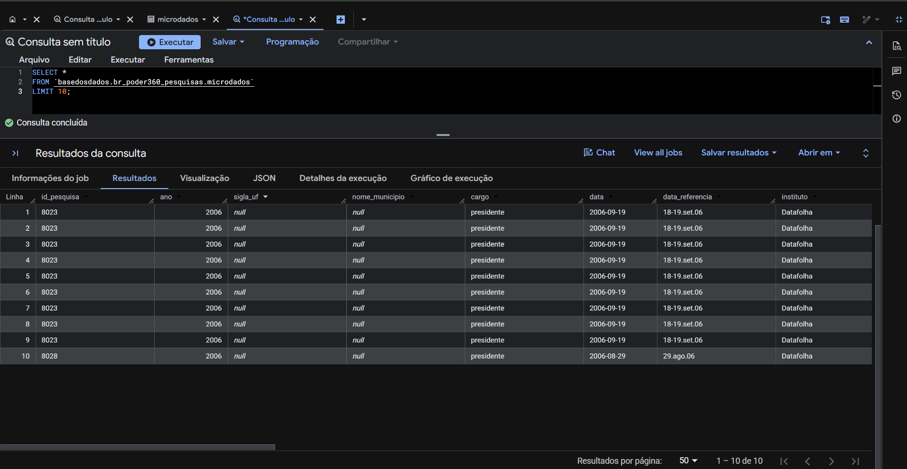
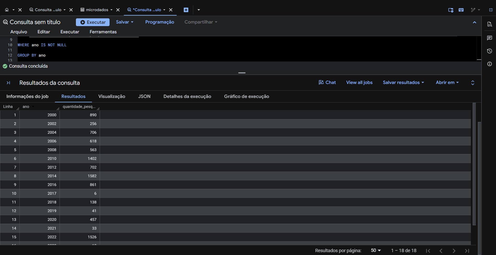
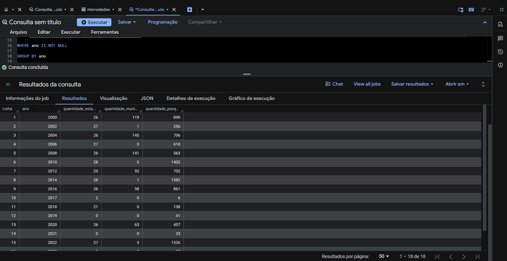
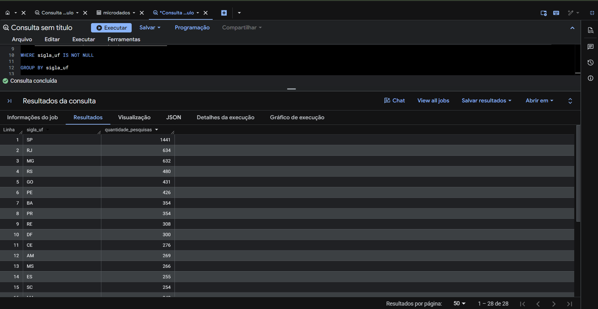
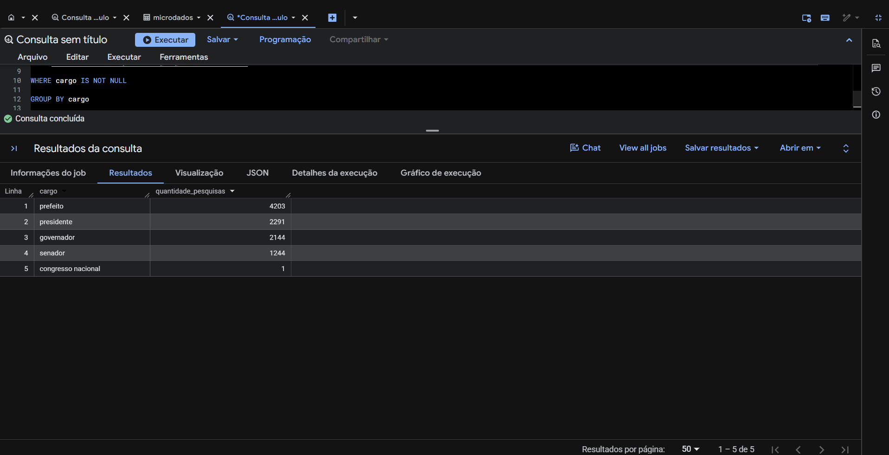
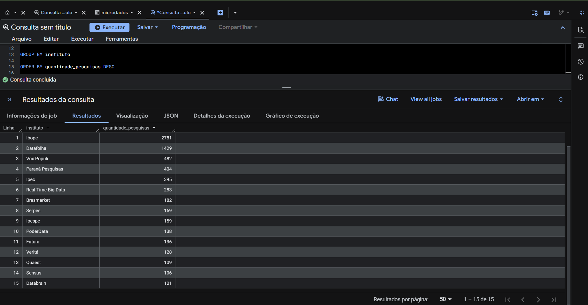
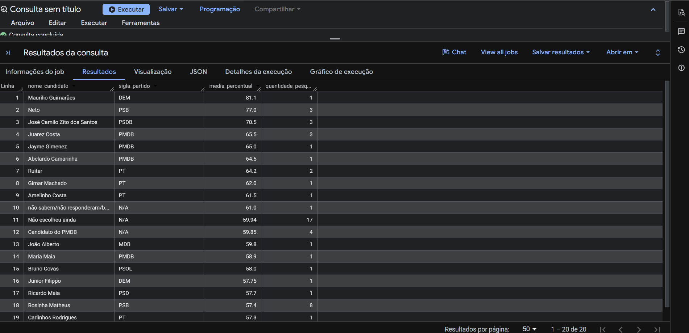
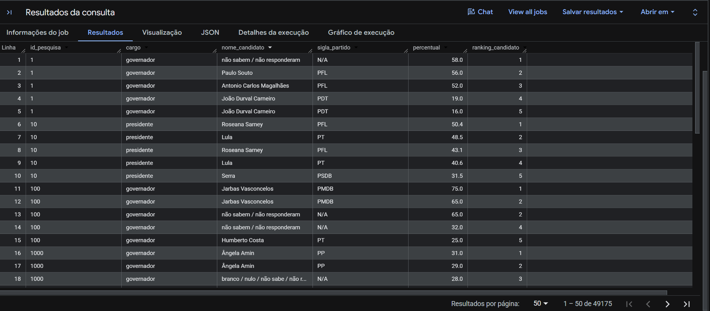
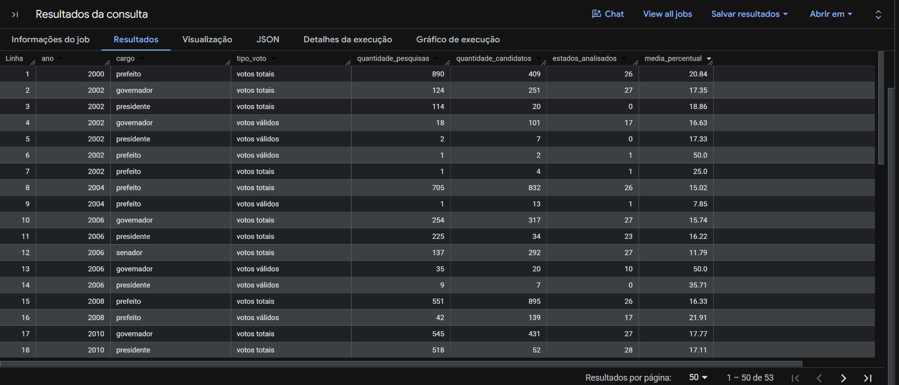

# Análise de Pesquisas Eleitorais com SQL e BigQuery


---

# Sobre o Projeto

Este projeto apresenta uma análise exploratória e analítica de pesquisas eleitorais utilizando **SQL no Google BigQuery**.

O objetivo foi explorar uma base pública de pesquisas eleitorais, aplicando técnicas de análise de dados para compreender diferentes aspectos das pesquisas realizadas no Brasil.

Foram desenvolvidas análises envolvendo:

- distribuição das pesquisas ao longo dos anos;
- cobertura geográfica por estados e municípios;
- cargos eleitorais analisados;
- institutos responsáveis pelas pesquisas;
- análise de candidatos;
- rankings utilizando funções analíticas;
- criação de métricas consolidadas para consumo analítico.

As consultas foram desenvolvidas em SQL utilizando o Google BigQuery, uma plataforma de **Data Warehouse em nuvem**, permitindo trabalhar com grandes volumes de dados de forma eficiente.

---

# Fonte dos Dados

Os dados utilizados neste projeto foram disponibilizados pela **Base dos Dados**, através da tabela pública de pesquisas eleitorais do Poder360.

Dataset:

https://basedosdados.org/dataset/fb38dbe8-03ce-46b4-a6b7-638ade03999c

Tabela utilizada:

```sql
basedosdados.br_poder360_pesquisas.microdados
```

---

# Tecnologias Utilizadas

- SQL
- Google BigQuery
- GitHub
- Markdown

---

# Objetivos do Projeto

Este projeto foi desenvolvido com os seguintes objetivos:

- praticar SQL utilizando dados reais;
- explorar uma base pública de grande volume;
- aplicar técnicas de análise exploratória;
- desenvolver consultas analíticas;
- utilizar funções avançadas de SQL;
- criar uma estrutura organizada de projeto para portfólio.

---

# Estrutura do Projeto

```text
sql-eleicoes-bigquery/

│
├── README.md
│
├── images/
│   ├── 01_exploracao_tabela.png
│   ├── 02_distribuicao_pesquisas.png
│   ├── 03_cobertura_geografica_por_ano.png
│   ├── 04_distribuicao_estados.png
│   ├── 05_distribuicao_cargos.png
│   ├── 06_institutos_pesquisa.png
│   ├── 07_analise_candidatos.png
│   ├── 08_window_functions.png
│   └── 09_tabela_analitica_final.png
│
├── queries/
│   ├── 01_exploracao.sql
│   ├── 02_qualidade_dados.sql
│   ├── 03_analise_pesquisas.sql
│   ├── 04_analise_candidatos.sql
│   ├── 05_window_functions.sql
│   ├── 06_analise_temporal.sql
│   ├── 07_rankings.sql
│   └── 08_consultas_avancadas.sql
│
└── docs/
    └── dicionario_dados.md
```

---

# Estrutura dos Dados

A tabela analisada contém informações relacionadas às pesquisas eleitorais.

Principais campos utilizados:

| Campo | Descrição |
|---|---|
| id_pesquisa | Identificador da pesquisa |
| ano | Ano da pesquisa |
| sigla_uf | Unidade Federativa |
| nome_municipio | Município analisado |
| cargo | Cargo eleitoral |
| data | Data da pesquisa |
| instituto | Instituto responsável |
| contratante | Contratante da pesquisa |
| quantidade_entrevistas | Número de entrevistas realizadas |
| margem_mais | Margem superior de erro |
| margem_menos | Margem inferior de erro |
| tipo_voto | Tipo de voto analisado |
| nome_candidato | Nome do candidato |
| sigla_partido | Partido do candidato |
| percentual | Percentual registrado |

---

# Tratamento e Qualidade dos Dados

Antes das análises foram realizadas verificações de qualidade na tabela original.

Os dados originais da Base dos Dados não foram alterados.

Todas as validações foram realizadas utilizando consultas SQL no BigQuery.

## Valores nulos

Foram analisados campos com possíveis valores ausentes:

- candidato;
- partido;
- instituto;
- percentual;
- quantidade de entrevistas.

Os registros não foram removidos da tabela original.

Quando necessário, filtros foram aplicados apenas durante as análises.

---

## Valores vazios

Foram verificadas informações textuais vazias em campos como:

- nome do candidato;
- partido;
- instituto;
- unidade federativa.

---

## Validação de percentuais

Foi realizada uma análise da coluna:

```sql
percentual
```

Considerando valores esperados entre:

```text
0 e 100
```

---

## Duplicidade

Foram analisados possíveis registros duplicados considerando:

- id_pesquisa;
- id_cenario;
- nome_candidato.

---

# Análises Realizadas

---

# 01 - Exploração Inicial da Base

Objetivo:

Compreender a estrutura da tabela, campos disponíveis e primeiros registros.

Arquivo SQL:

```
queries/01_exploracao.sql
```

Resultado:



---

# 02 - Distribuição das Pesquisas por Ano

Objetivo:

Analisar a quantidade de pesquisas eleitorais disponíveis ao longo dos anos.

Arquivo SQL:

```
queries/03_analise_pesquisas.sql
```

Resultado:



---

# 03 - Cobertura Geográfica das Pesquisas

Objetivo:

Avaliar a abrangência territorial das pesquisas considerando estados e municípios.

Métricas analisadas:

- quantidade de estados;
- quantidade de municípios;
- quantidade de pesquisas.

Arquivo SQL:

```
queries/03_analise_pesquisas.sql
```

Resultado:



---

# 04 - Distribuição das Pesquisas por Estado

Objetivo:

Identificar a concentração das pesquisas por Unidade Federativa.

Campo analisado:

```sql
sigla_uf
```

Arquivo SQL:

```
queries/03_analise_pesquisas.sql
```

Resultado:



---

# 05 - Distribuição por Cargo Eleitoral

Objetivo:

Analisar a quantidade de pesquisas por cargo eleitoral.

Exemplos:

- Presidente;
- Governador;
- Prefeito;
- Senador;
- Deputados.

Arquivo SQL:

```
queries/03_analise_pesquisas.sql
```

Resultado:



---

# 06 - Institutos Responsáveis pelas Pesquisas

Objetivo:

Identificar os institutos com maior quantidade de pesquisas registradas.

Arquivo SQL:

```
queries/08_consultas_avancadas.sql
```

Resultado:



---

# 07 - Análise de Candidatos

Objetivo:

Comparar candidatos considerando:

- média percentual registrada;
- quantidade de pesquisas analisadas.

Métrica utilizada:

```sql
AVG(percentual)
```

Arquivo SQL:

```
queries/04_analise_candidatos.sql
```

Resultado:



---

# 08 - Window Functions

Objetivo:

Aplicar funções analíticas utilizando:

- RANK();
- PARTITION BY.

A análise cria rankings considerando cada pesquisa individualmente.

Arquivo SQL:

```
queries/05_window_functions.sql
```

Resultado:



---

# 09 - Tabela Analítica Final

Objetivo:

Criar uma visão consolidada preparada para consumo analítico.

Indicadores:

- ano;
- cargo;
- tipo de voto;
- quantidade de pesquisas;
- quantidade de candidatos;
- estados analisados;
- média percentual.

Arquivo SQL:

```
queries/08_consultas_avancadas.sql
```

Resultado:



---

# Principais Conceitos Aplicados

## SQL

Foram utilizados:

- SELECT;
- WHERE;
- GROUP BY;
- ORDER BY;
- COUNT;
- AVG;
- DISTINCT;
- CTEs;
- Window Functions.

## Análise de Dados

Conceitos aplicados:

- exploração de dados;
- limpeza e validação;
- criação de métricas;
- análise temporal;
- análise geográfica;
- preparação de dados para visualização.

---

# Possíveis Melhorias Futuras

Como evolução do projeto, podem ser adicionadas:

- criação de dashboard no Power BI ou Looker Studio;
- análise da evolução dos candidatos ao longo do tempo;
- comparação entre institutos de pesquisa;
- análise considerando margem de erro;
- criação de modelo dimensional de dados;
- criação de tabelas analíticas para consumo.

---

# Conclusão

Este projeto demonstra a aplicação de SQL e Google BigQuery na análise de dados eleitorais públicos.

Através das consultas desenvolvidas foi possível transformar uma base de pesquisas eleitorais em informações analíticas, explorando aspectos temporais, geográficos e eleitorais.

O projeto apresenta desde a exploração inicial dos dados até a criação de uma tabela analítica consolidada, demonstrando um fluxo completo de análise utilizando SQL.

---

# Autor

**Polyana Lima**

Projeto desenvolvido para demonstração de habilidades em análise de dados utilizando SQL e Google BigQuery.
